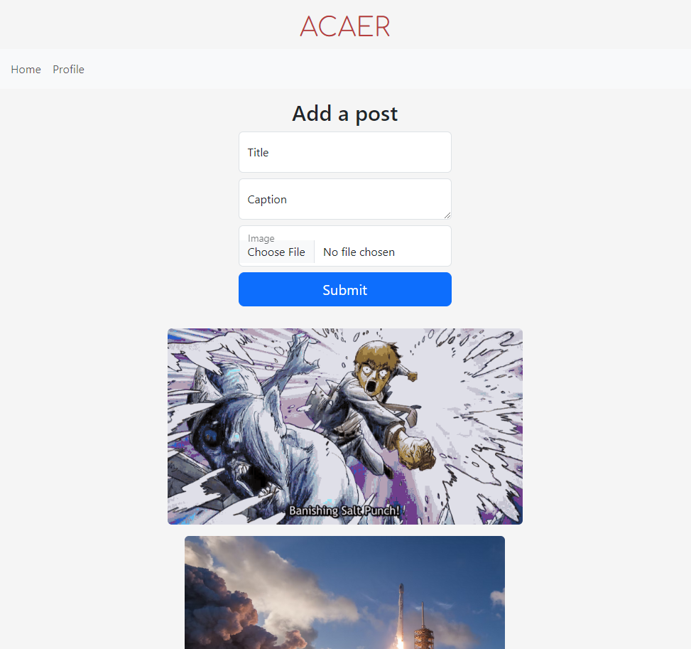
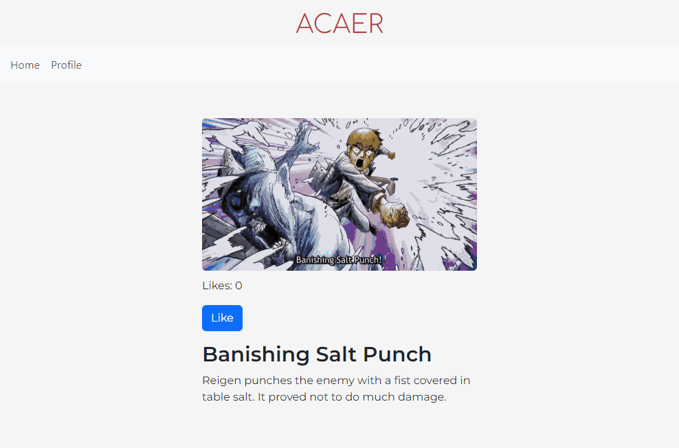
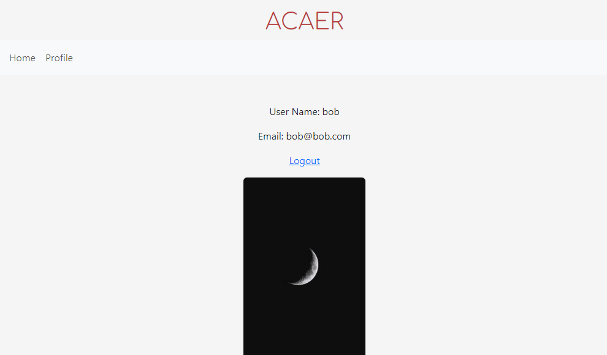

# ACAER
Login and create new posts. Like a post by clicking the Like button. If the user owns a post, it can be deleted by clicking the Trash button. See created posts by heading to the Profile page.

## Tech Used
HTML, CSS, JavaScript, Pug, Bootstrap, Node, MongoDB, Git, MVC architecture

## Things to add
Create a `.env` file in config folder and add the following as `key = value`.
 
 * PORT = 2222
 * DB_CONNECTION_STRING = `your database URI`
 * CLOUD_NAME = `your cloudinary cloud name`
 * API_KEY = `your cloudinary api key`
 * API_SECRET = `your cloudinary api secret`

## How to run application
### Install dependencies
`npm install`

### Run
`npm start`

## Screenshots

